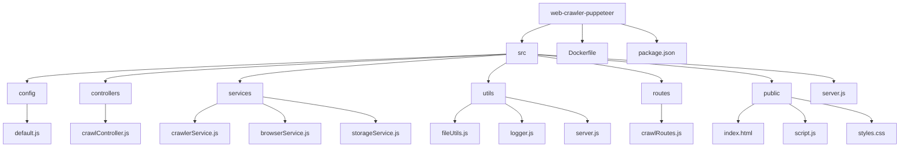

# Gelişmiş Web Sitesi Tarayıcısı

## İçindekiler

1. [Giriş](#giriş)
2. [Özellikler](#özellikler)
3. [Proje Yapısı](#proje-yapısı)
4. [Kurulum](#kurulum)
5. [Kullanım](#kullanım)
6. [Yapılandırma](#yapılandırma)
7. [Detaylı Özellikler ve Kod Örnekleri](#detaylı-özellikler-ve-kod-örnekleri)
8. [Dosya Açıklamaları](#dosya-açıklamaları)
9. [Gelişmiş Özellikler](#gelişmiş-özellikler)
10. [Sorun Giderme](#sorun-giderme)
11. [Katkıda Bulunma](#katkıda-bulunma)
12. [Lisans](#lisans)

## Giriş

Gelişmiş Web Sitesi Tarayıcısı, karmaşık web sitelerinde gezinmek, dinamik içeriklerle başa çıkmak ve yaygın bot önleme yöntemlerini aşmak için tasarlanmış güçlü ve özelliklerle dolu bir web tarama çözümüdür. Kullanıcı dostu arayüzü ve sağlam altyapısıyla, hem yeni başlayanlar hem de ileri düzey kullanıcılar için uygundur.

## Özellikler

- 🌓 Karanlık mod arayüzü
- 🕷️ Özelleştirilebilir derinlik ve sayfa limitleri ile derin tarama
- 🔐 Korunan içeriklere erişim için giriş desteği
- 🔄 Kolay yapılandırılabilir vekil sunucu (proxy) desteği
- 🖥️ Tarayıcı profili yükleme ile tutarlı tarama oturumları
- 🤖 Gelişmiş bot tespiti engelleme teknikleri
- 🧩 Etkileşimli öğe çıkarma (düğmeler, açılır pencereler)
- 🔍 Ayrıntılı tarama kayıtları ve gerçek zamanlı ilerleme takibi
- 📊 Grafiklerle görsel tarama ilerlemesi
- 🖼️ Sayfa önizleme işlevi
- ⚙️ Esnek yapılandırma seçenekleri
- 🔄 Dinamik içerik yakalama
- 🤖 CAPTCHA çözümü (2captcha entegrasyonu)
- 📊 Gerçek zamanlı crawling istatistikleri
- 🛑 Crawling işlemini durdurma ve devam ettirme
- 📦 Crawl edilen siteyi zip dosyası olarak indirme

## Proje Yapısı



## Kurulum

1. Depoyu klonlayın:
   ```
   [git clone https://github.com/kullanıcıadınız/advanced-website-crawler.git](https://github.com/AhmetShbz/web-crawler-puppeteer.git)
   ```

2. Proje dizinine gidin:
   ```
   cd web-crawler-puppeteer-main
   ```

3. Bağımlılıkları yükleyin:
   ```
   npm install
   ```

4. `src/config/default.js` dosyasında yapılandırmanızı yapın.

5. Sunucuyu başlatın:
   ```
   npm start
   ```

6. Tarayıcınızı açın ve tarayıcı arayüzüne erişmek için `http://localhost:3000` adresine gidin.

## Kullanım

1. "Website URL" alanına hedef URL'yi girin.
2. "Max Depth" ve "Max Pages" ayarlarını ihtiyacınıza göre ayarlayın.
3. Site giriş gerektiriyorsa, "Giriş Bilgilerini Kullan" anahtarını etkinleştirin ve gerekli bilgileri girin.
4. Vekil sunucu (proxy) kullanmak istiyorsanız, "Proxy Kullan" anahtarını etkinleştirip vekil sunucu bilgilerini girin.
5. (İsteğe bağlı) Tutarlı tarama oturumları için bir tarayıcı profili yükleyin.
6. Tarama işlemine başlamak için "Tarama Başlat" düğmesine tıklayın.
7. Gerçek zamanlı ilerlemeyi ilerleme çubuğu, grafik ve kayıtlar ile izleyin.
8. Tamamlandığında, taranan verileri `downloads` dizininde bulabilirsiniz.

## Yapılandırma

Ana yapılandırma dosyası `src/config/default.js` konumundadır. İşte anahtar ayarların açıklaması:

```javascript
module.exports = {
  server: {
    port: 3000 // Sunucunun çalışacağı port
  },
  crawler: {
    maxDepth: 3, // Varsayılan maksimum tarama derinliği
    maxPages: 100, // Varsayılan maksimum sayfa sayısı
    waitTime: 5000, // Dinamik içeriğin yüklenmesi için bekleme süresi (ms)
    userAgent: "Mozilla/5.0 (Windows NT 10.0; Win64; x64) AppleWebKit/537.36 (KHTML, like Gecko) Chrome/91.0.4472.124 Safari/537.36" // Varsayılan user agent stringi
  },
  proxy: {
    host: '**********', // Varsayılan proxy hostu
    port: '**********', // Varsayılan proxy portu
    username: '**********', // Varsayılan proxy kullanıcı adı
    password: '**********' // Varsayılan proxy şifresi
  },
  recaptcha: {
    provider: '2captcha',
    apiKey: 'YOUR_2CAPTCHA_API_KEY' // CAPTCHA'ları çözmek için 2captcha API anahtarınız
  }
};
```

## Dosya Açıklamaları

1. **src/server.js**: Express sunucusunu başlatır ve yapılandırır.
2. **src/controllers/crawlController.js**: HTTP isteklerini işler ve crawling işlemlerini yönetir.
3. **src/services/crawlerService.js**: Ana crawling mantığını içerir.
4. **src/services/browserService.js**: Tarayıcı işlemlerini yönetir.
5. **src/services/storageService.js**: Veri depolama işlemlerini yönetir.
6. **src/services/interactionService.js**: Sayfa etkileşimlerini simüle eder.
7. **src/services/apiCaptureService.js**: API çağrılarını yakalar ve simüle eder.
8. **src/services/offlineService.js**: Offline kullanım için siteyi hazırlar.
9. **src/utils/fileUtils.js**: Dosya işlemleri için yardımcı fonksiyonlar sağlar.
10. **src/utils/logger.js**: Loglama işlemlerini yönetir.
11. **src/utils/waitForEvent.js**: Asenkron işlemler için güvenli bekleme mekanizması sağlar.
12. **src/middleware/errorHandler.js**: Hata yönetimi middleware'i.
13. **src/middleware/rateLimiter.js**: Rate limiting uygular.
14. **src/public/index.html**: Ana web arayüzü sayfası.
15. **src/public/script.js**: Kullanıcı arayüzü mantığını içerir.
16. **src/public/styles.css**: Kullanıcı arayüzü stillerini tanımlar.
17. **src/config/default.js**: Uygulama genelinde kullanılan yapılandırma ayarlarını içerir.
18. **Dockerfile**: Docker konteyner yapılandırmasını tanımlar.
19. **package.json**: Proje meta verilerini ve bağımlılıklarını tanımlar.

## Gelişmiş Özellikler

### Tarayıcı Profili Yükleme

Tarama oturumlarında tutarlı parmak izleri sağlamak için bir `.tar.gz` dosyası olarak tarayıcı profili yükleyebilirsiniz.

### Proxy Yapılandırması

Tarayıcı, IP tabanlı hız sınırlamalarından kaçınmak ve coğrafi olarak kısıtlanmış içeriğe erişmek için proxy kullanımını destekler.

### Etkileşimli Öğelerin Çıkarılması

Tarayıcı, otomatik olarak düğmeler ve açılır pencereler gibi etkileşimli öğeleri tespit eder ve kaydeder.

### CAPTCHA Çözme

2captcha desteği ile entegre olarak, tarayıcı tarama işlemi sırasında karşılaşılan CAPTCHA'ları otomatik olarak çözebilir.


Bu proje MIT Lisansı altında lisanslanmıştır - detaylar için [LİSANS](LICENSE) dosyasına bakabilirsiniz.

---
